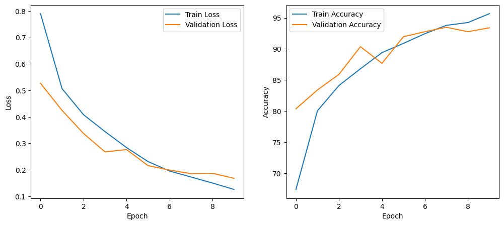
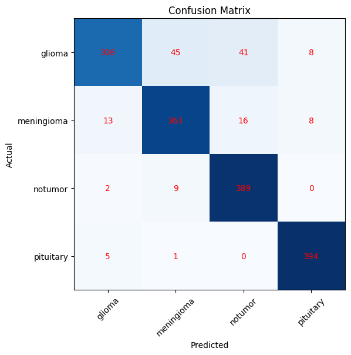

# Brain Tumor MRI Classification using PyTorch

A deep learning project that classifies brain MRI images into four categories using a Convolutional Neural Network (CNN) implemented in PyTorch.

---

## Project Overview

Brain tumor diagnosis from MRI scans is an important application of medical image analysis. This project develops a Convolutional Neural Network (CNN) capable of classifying brain MRI images into one of the following four classes:

- Glioma
- Meningioma
- Pituitary Tumor
- No Tumor

The project demonstrates the complete deep learning workflow, including data preprocessing, augmentation, model development, training, evaluation, and performance analysis.

---

## Dataset

This project uses the **Brain Tumor MRI Dataset** available on Kaggle.

**Dataset Link:**
https://www.kaggle.com/datasets/masoudnickparvar/brain-tumor-mri-dataset

**Dataset Structure**

```
Training/
    ├── glioma
    ├── meningioma
    ├── pituitary
    └── notumor

Testing/
    ├── glioma
    ├── meningioma
    ├── pituitary
    └── notumor
```

After downloading the dataset, place the `Training` and `Testing` folders in the project directory before running the notebook.

---

## Technologies Used

- Python
- PyTorch
- Torchvision
- NumPy
- Pandas
- Matplotlib
- Scikit-learn
- Google Colab

---

## Data Preprocessing

The following preprocessing steps were applied before training:

- Image resizing to **224 × 224**
- Tensor conversion
- Pixel normalization
- Data augmentation using:
  - Random Horizontal Flip
  - Random Rotation

---

## Model Architecture

The custom CNN consists of:

- Convolutional Layers
- ReLU Activation
- Max Pooling
- Fully Connected Layers
- Softmax Classification

The model is trained using:

- Loss Function: CrossEntropyLoss
- Optimizer: Adam
- Batch Size: 32
- Epochs: 10

---

## Model Performance

Final Test Accuracy:

**87.8%**

The notebook also includes:

- Training Loss Curve
- Validation Loss Curve
- Training Accuracy Curve
- Validation Accuracy Curve
- Confusion Matrix
- Classification Report

---

## Results

## Training Curves

### Accuracy & Loss



### Confusion Matrix



## Repository Structure

```
brain-tumor-classification-pytorch/
│
├── Brain_Tumor_Classification.ipynb
├── README.md
├── requirements.txt
├── LICENSE
├── .gitignore
└── images/
```

---

## How to Run

1. Clone this repository.

```
git clone https://github.com/SirishaValluru/brain-tumor-classification-pytorch.git
```

2. Install the required packages.

```
pip install -r requirements.txt
```

3. Download the dataset from Kaggle.

4. Extract the dataset.

5. Place the `Training` and `Testing` folders inside the project directory.

6. Open the notebook and run all cells sequentially.

---

## Future Improvements

- Train deeper CNN architectures (e.g., ResNet, DenseNet, EfficientNet)
- Improve performance through hyperparameter tuning
- Implement Grad-CAM for model interpretability
- Deploy the model as a web application using Streamlit or Flask

---

## Acknowledgements

This project was developed as part of my deep learning journey.

The implementation was inspired by publicly available educational resources, including the official PyTorch documentation, the Kaggle Brain Tumor MRI Dataset, and online tutorial materials. The code was studied, adapted, documented, and organized by the author for educational and portfolio purposes.

---

## Author

**Sirisha Valluru**

GitHub: https://github.com/SirishaValluru
